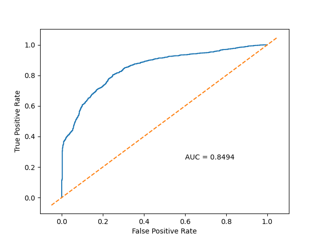

 # Space-Titanic
## Kaggle Competition

Welcome to the year 2912. We've received a transmission from four lightyears away and things aren't looking good.

The Spaceship Titanic was an interstellar passenger liner launched a month ago. With almost 13,000 passengers on board, the vessel set out on its maiden voyage transporting emigrants from our solar system to three newly habitable exoplanets orbiting nearby stars.

While rounding Alpha Centauri en route to its first destination—the torrid 55 Cancri E—the unwary Spaceship Titanic collided with a spacetime anomaly hidden within a dust cloud. Sadly, it met a similar fate as its namesake from 1000 years before. Though the ship stayed intact, almost half of the passengers were transported to an alternate dimension!

To help rescue crews and retrieve the lost passengers, you are challenged to predict which passengers were transported by the anomaly using records recovered from the spaceship’s damaged computer system.

### Exploratory Data Analysis
As stated in the prompt, some of the data is damaged. During EDA I examine the data structure and both transform the data to be more useful, but also impute data so that more of the data can be used for training the eventual model.  This preliminary work is contained in the [EDA Notebook](https://github.com/WestlakeData/Space-Titanic/blob/main/EDA.ipynb).

### Logit Regression Model
As a baseline model we generated a Logit model, this is contained in [Logistic Regression Notebook](https://github.com/WestlakeData/Space-Titanic/blob/main/Logit%20Modelling.ipynb).

The basic performance metrics for this model were as follows.  
Accuracy =   0.77  
F-Score =    0.78  
Precision =  0.76  
Recall =     0.81  
Kappa =      0.55  
  
  

